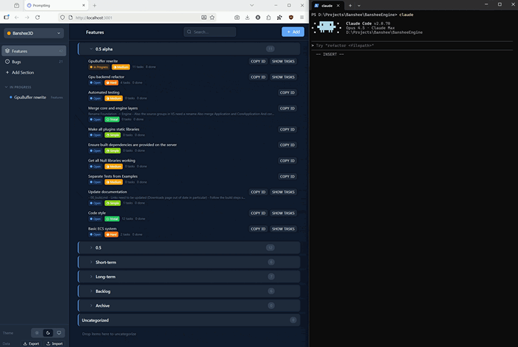

# Promptling - Task Management for Claude Code

Lightweight task/project management app (think Jira, but simpler) designed to work with Claude Code via MCP (Model Context Protocol).

## How I use it

- **Creating work items** - Use the web UI to record all your ideas into work items (tasks, features, bugs).
- **Plan** - Use `/plan <id>` for complex features/tasks. No hard-to-track .md files everywhere, plan is attached to the work item.
- **Implementation** - `/implement <id>` reads the work item details, including plan and any attachments (e.g. images) and starts coding.

## Key Features

- Copy button to quickly copy work item IDs to Claude Code
- Auto-generate work items from Claude
- Change history tracking
- Integrated markdown viewer
- Attachment support (images and other documents)
- Multi-project support
- Sections (Features & Bugs, custom sections)
- Break down features into sub-tasks
- Categories for grouping items
- Drag & drop reordering
- Item status tracking (Open → In Progress → Done)
- Item priority, complexity, custom tags
- Light/Dark/System themes
- File-based storage (no database needed)
- Runs locally on your machine

## Quick Start

### Prerequisites
- [Node.js](https://nodejs.org/) v18 or later

### One-Click Launch
1. **Windows:** Double-click `start-promptling.bat`
2. **macOS/Linux:** Run `./start-promptling.sh` (may need `chmod +x start-promptling.sh` first)

The launcher will automatically:
- Install dependencies (first run only)
- Build the client (first run only)
- Start the server and open your browser to http://localhost:3001

### Manual Setup
If you prefer manual setup or the launcher doesn't work:

```bash
# Install dependencies
npm install

# Build the client
cd client && npm run build && cd ..

# Start the server
cd server && node index.js
```

Then open http://localhost:3001 in your browser.

### Rebuild Script (PM2 Workflow)

If you're running Promptling under PM2 and want to rebuild everything first:

```bash
# Windows
rebuild-promptling.bat

# Or via npm
npm run rebuild
```

Then restart PM2:

```bash
pm2 restart promptling
```

### Add MCP Tools to Claude Code 

Add the Promptling MCP server so Claude can interact with your tasks:

```bash
claude mcp add --transport http promptling http://localhost:3001/api/mcp
```

Promptling uses a single MCP endpoint (`/api/mcp`) with Streamable HTTP support and legacy JSON-RPC POST compatibility.
If Claude is already configured to `http://localhost:3001/api/mcp`, no endpoint change is required after updates.

Restart Claude Code. You'll now have access to tools like `search`, `get`, `create`, `update`, `list`, and `read` for managing items.

### Install Custom Commands

Copy the custom commands to your Claude config:

```bash
# Windows
xcopy /E /I /path/to/promptling/.claude/commands %USERPROFILE%\.claude\commands

# macOS/Linux
cp -r /path/to/promptling/.claude/commands ~/.claude/commands
```

**Available commands:**
- `/plan <item>` - Create/update an implementation plan
- `/implement <item>` - Implement a feature/bug from its plan

---

## Detailed Setup Guide

Step-by-step instructions for setting up Promptling from scratch.

### Step 1: Install Node.js

1. Download Node.js LTS from https://nodejs.org/
2. Run the installer (use default settings)
3. Restart your terminal/command prompt
4. Verify installation:
   ```bash
   node --version   # Should show v18+ or v20+
   npm --version    # Should show 9+ or 10+
   ```

### Step 2: Get the Project

Either clone from git or copy the project folder to your desired location (e.g., `D:\Projects\Promptling`).

### Step 3: Install Dependencies

```bash
cd D:\Projects\Promptling
npm install
```

This installs dependencies for the root, client, and server.

### Step 4: Build the Client

```bash
cd D:\Projects\Promptling\client
npm run build
```

### Step 5: Start the Server

**Option A: Simple start (stops when terminal closes)**
```bash
cd D:\Projects\Promptling\server
node index.js
```

**Option B: Persistent service with PM2 (recommended)**
```bash
# Install PM2 globally
npm install -g pm2

# Start the server
cd D:\Projects\Promptling\server
pm2 start index.js --name "promptling"

# Save process list so PM2 remembers it
pm2 save

# (Optional) Install PM2 Windows service for auto-start on boot
npm install -g pm2-windows-startup
pm2-startup install
```

### Step 6: Access the App

Open http://localhost:3001 in your browser.

---

## Tech Stack

- **Frontend:** React 19 + Vite
- **Backend:** Express 5 + Node.js
- **Drag & Drop:** @dnd-kit
- **Markdown:** react-markdown

## Project Structure

```
Promptling/
├── client/           # React frontend
│   ├── src/
│   └── dist/         # Built files (after npm run build)
├── server/           # Express backend
│   ├── index.js
│   └── routes/
├── .promptling/      # Data storage (created automatically)
│   ├── data.json
│   └── attachments/
└── package.json      # Root workspace
```

## Development Mode

For active development with hot reload:

```bash
cd D:\Projects\Promptling
npm run dev
```

This starts both the client (port 5173) and server (port 3001) with hot reload.

- Frontend: http://localhost:5173
- API: http://localhost:3001/api

## Production Deployment

### Build the Client

```bash
cd D:\Projects\Promptling\client
npm run build
```

This creates optimized static files in `client/dist/`.

### Start the Server

The server serves both the API and the built React frontend.

```bash
cd D:\Projects\Promptling\server
node index.js
```

Access the app at: http://localhost:3001

## Running as a Persistent Service (Windows)

### Using PM2 (Recommended)

```bash
# Install PM2 globally
npm install -g pm2

# Start the server
cd D:\Projects\Promptling\server
pm2 start index.js --name "promptling"
pm2 save

# Install as Windows service (run as Administrator)
npm install -g pm2-windows-startup
pm2-startup install
```

### PM2 Commands

| Command | Description |
|---------|-------------|
| `pm2 list` | Show running processes |
| `pm2 logs promptling` | View logs |
| `pm2 restart promptling` | Restart server |
| `pm2 stop promptling` | Stop server |
| `pm2 delete promptling` | Remove from PM2 |

### Alternative: Windows Task Scheduler

1. Press `Win+R`, type `taskschd.msc`
2. Create Basic Task → Name: "Promptling Server"
3. Trigger: "When the computer starts"
4. Action: "Start a program"
   - Program: `C:\Program Files\nodejs\node.exe`
   - Arguments: `index.js`
   - Start in: `D:\Projects\Promptling\server`
5. Enable "Run whether user is logged on or not"

## Updating After Code Changes

```bash
# Rebuild client
cd D:\Projects\Promptling\client
npm run build

# Restart server
pm2 restart promptling
```

## API Endpoints

| Method | Endpoint | Description |
|--------|----------|-------------|
| GET | `/api/tasks` | Load all data |
| GET | `/api/health` | Health check |
| POST | `/api/tasks/feature` | Create feature |
| POST | `/api/tasks/bug` | Create bug |
| POST | `/api/tasks/task` | Create task |
| PATCH | `/api/tasks/:type/:id` | Update item |
| DELETE | `/api/tasks/:type/:id` | Delete item |
| PUT | `/api/tasks/reorder` | Reorder items |
| POST | `/api/tasks/attachment` | Upload attachment |

## Data Storage

All data is stored in the `.promptling` directory by default:
- `projects.json` - Project metadata
- `settings.json` - Global settings
- `projects/<project-id>/data.json` - Project data (items, tasks, categories)
- `projects/<project-id>/attachments/` - File attachments

## Configuration

### Data Directory Location

By default, Promptling stores all data in the `.promptling` directory within the project folder. You can customize this location by creating a `promptling.config.json` file in the project root:

```json
{
  "dataDir": ".promptling"
}
```

The `dataDir` can be:
- **Relative path** (relative to the project root): `".promptling"`, `"../my-data"`, `"data/promptling"`
- **Absolute path**: `"D:\\MyData\\promptling"`, `"/home/user/promptling-data"`

This is useful when you want to:
- Store data outside the project folder (e.g., for backup purposes)
- Share data between multiple Promptling instances
- Keep data separate from the application code

See `promptling.config.example.json` for an example configuration.

### Server Port

The server port can be changed via environment variable:

```bash
set PORT=8080 && node index.js
```

## Troubleshooting

### Port already in use

```bash
# Find what's using the port
netstat -ano | findstr ":3001"

# Kill the process
taskkill /PID <pid> /F
```

### Check if server is running

Open http://localhost:3001/api/health in browser or run:

```bash
curl http://localhost:3001/api/health
```

Should return: `{"status":"ok","timestamp":"..."}`

### PM2 not recognized after install

Close and reopen your terminal, or run:
```bash
refreshenv
```

### Dependencies missing after git clone

Make sure to run `npm install` in the project root:
```bash
cd D:\Projects\Promptling
npm install
```
